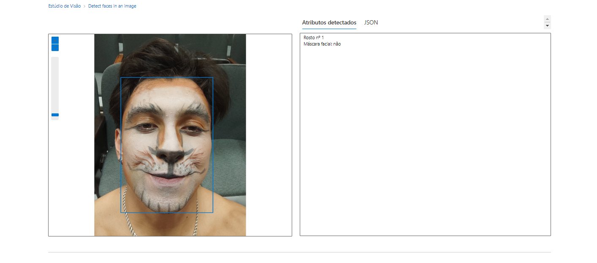
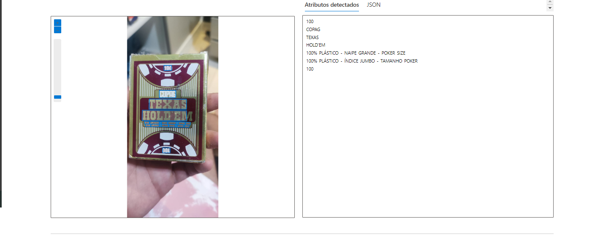
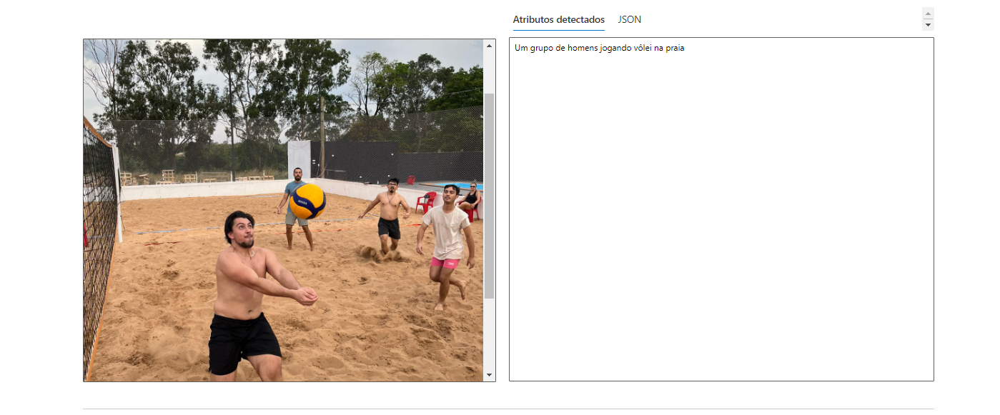

# Pojeto-02-AI900
## Reconhecimento Facial e transformação de imagens em Dados no Azure ML
## Objetivo 
### Laboratório para consolidar conhecimentos utilizando o Vision Studio do Azure IA para reconhecimento facial e transformação de imagens em Dados no Azure ML 

Passo a passo está na documentação oficial da Microsoft:                                 
[Detectar rostos no Vision Studio](https://microsoftlearning.github.io/mslearn-ai-fundamentals/Instructions/Labs/04-face.html)

[Ler texto no Vision Studio](https://microsoftlearning.github.io/mslearn-ai-fundamentals/Instructions/Labs/05-ocr.html)

[Analise imagens no Vision Studio](https://microsoftlearning.github.io/mslearn-ai-fundamentals/Instructions/Labs/03-image-analysis.html)

1. Crie um recurso
2. Selecionar AI + Machine Learning
3. Crie um Serviço Cognitivo no Azure
4. Acessar o portal do [Vision Studio](https://portal.vision.cognitive.azure.com/)

### Serviços de visão
* Detectar rostos no Vision Studio
1. Ir em Home > Face > Detect Faces in an image:
2. escolha uma foto ou faça upload
   

* Ler texto no Vision Studio

1. Ir em Optical Character Recognition > Extract Text from images
2. escolha uma foto ou faça upload
    

* Analise imagens no Vision Studio
1.  Ir em Image Analysis > Add captions to images
2. escolha uma foto ou faça upload
    
